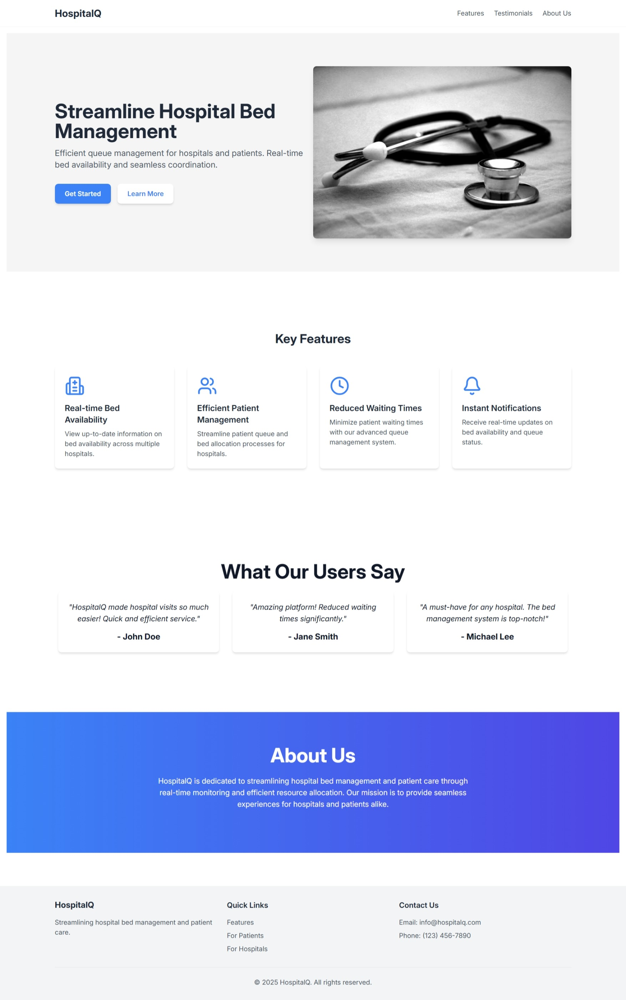
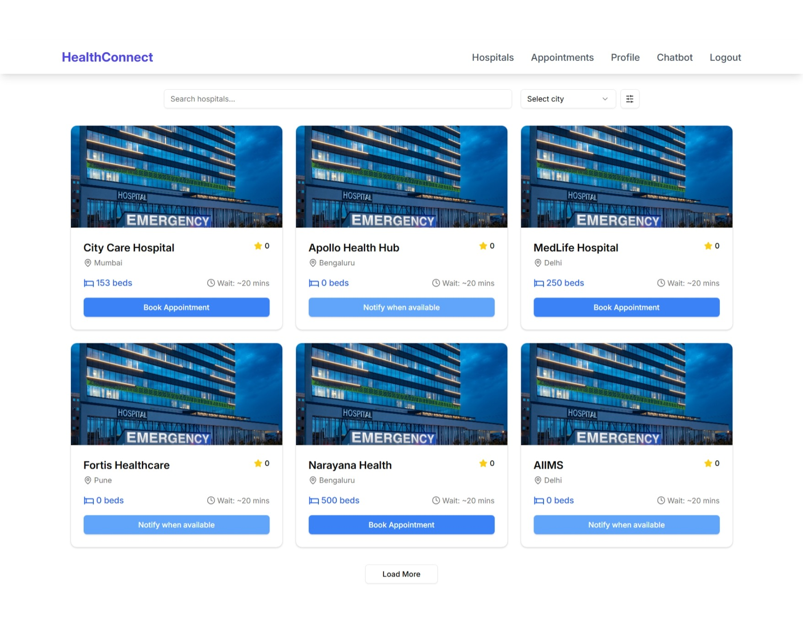
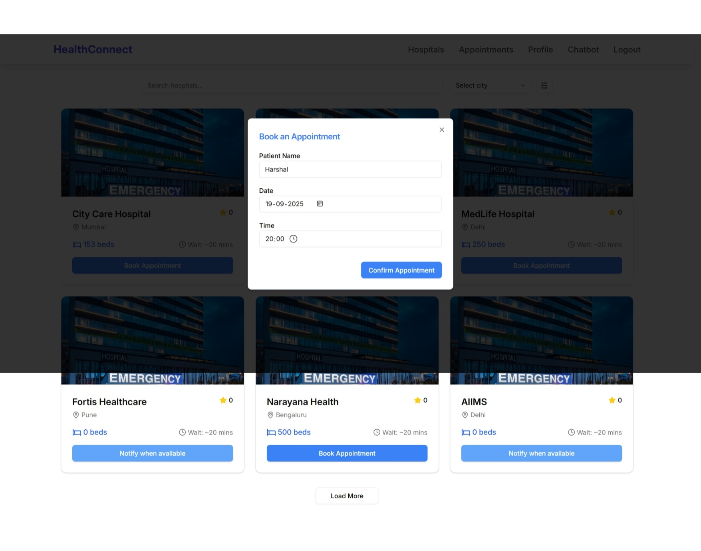
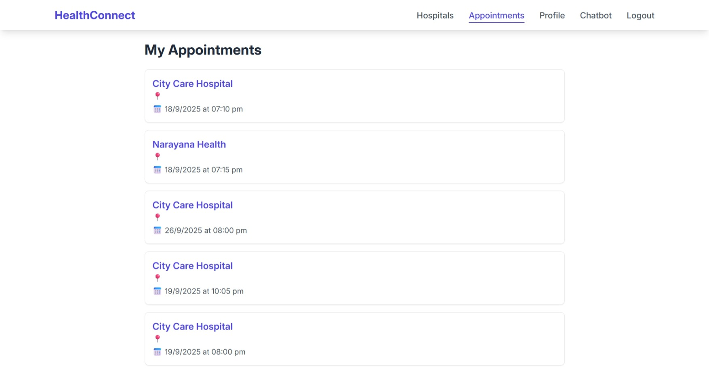
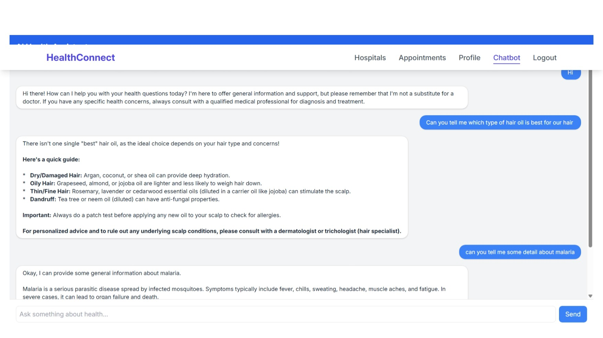
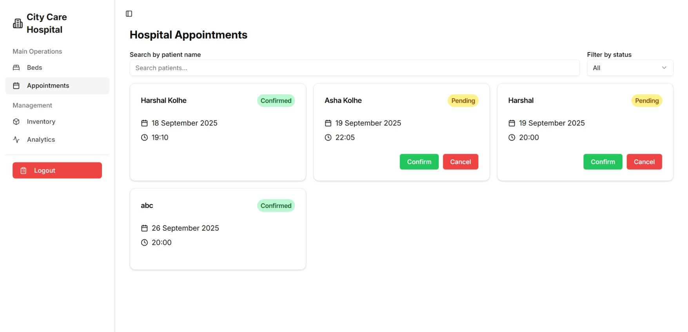
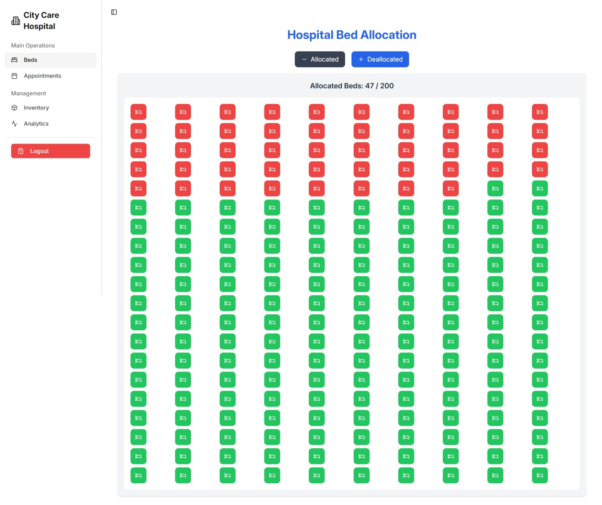
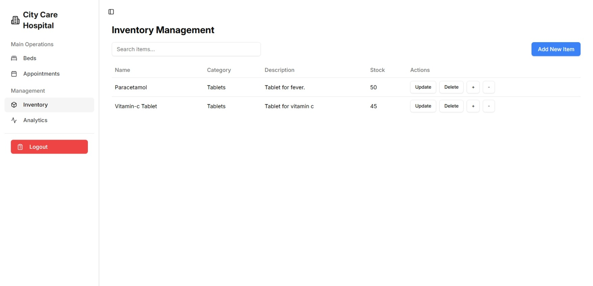
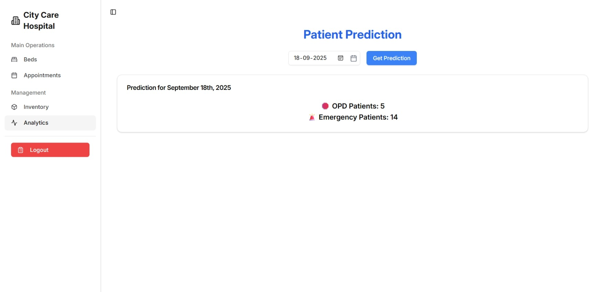

# 🏥 Hospital Queue and Inventory Management System

➡️ **[Live Demo](https://healhcare-app-1.onrender.com)**
(ML model not included in this cloud-based-live-link yet)

---

## 📖 Overview

The **Hospital Queue and Inventory Management System** is a **full-stack MERN application** designed to help hospitals manage **bed availability, appointments, inventory, and patient flow** efficiently.  
It also integrates a **healthcare chatbot** powered by **Gemini API** and an **ML model** (via Flask API) for predicting patient inflow.

---

## 🚀 Features

- **Authentication & Authorization**

  - JWT-based login & signup for both hospitals and patients.
  - Role-based access with different dashboards.

- **Patient Features**

  - Search hospitals with filters by city/location.
  - Check real-time bed availability.
  - Book and manage appointments.
  - Get health advice from the **AI chatbot** before booking.

- **Hospital Features**

  - Approve or cancel patient appointments.
  - Allocate & deallocate beds.
  - Manage inventory (add, update, delete items).
  - View predictive analytics for OPD/Emergency patients (ML model).

- **UI/UX Enhancements**

  - Built with **React + Vite** for fast rendering.
  - **Framer Motion** for smooth animations.
  - **Lucide React** icons for modern design.
  - **React Toastify** for real-time notifications.

- **Backend & APIs**
  - **Express.js** modular routes & controllers.
  - **MongoDB + Mongoose** for data storage.
  - **Flask API** integration for ML model predictions.
  - **CORS setup, dotenv, and error handling** for secure operations.

---

## 📑 Project Pages

1. **Index Page** – Overview of the website with intro to features.
   

2. **Authorization Page** – Login & Signup for both **hospitals** and **patients**.
   

3. **Patient Home Page** – Browse hospitals with filters, search, check bed availability, and book appointments.
   
   

4. **Patient Appointment Page** – View all appointments booked by the patient.
   

5. **Healthcare Chatbot** – AI-powered chatbot that answers basic medical questions and advises users to visit doctors.
   

6. **Hospital Appointment Page** – Hospitals can see all bookings, approve or cancel them.
   

7. **Bed Allocation Page** – Dashboard for allocated and unallocated beds; hospitals can allocate/deallocate beds.
   

8. **Inventory Page** – Hospitals can check, add, update, or delete inventory items.
   

9. **Prediction Page** – Displays **ML-based prediction** of OPD and Emergency patients for future dates.
   

---

## 🛠️ Tech Stack

- **Frontend:** React, Vite, Tailwind CSS, Framer Motion, React Toastify, Lucide React
- **Backend:** Node.js, Express.js, MongoDB, Mongoose
- **ML Integration:** Flask API with scikit-learn (predictive analytics)
- **AI Chatbot:** Gemini API integration
- **Deployment:** Render

---

## 📌 Future Improvements

- Deploy ML model in a **Docker container** for better scalability.
- Add **real-time notifications** (Email/SMS alerts).
- Improve chatbot with more advanced medical datasets.

---

👨‍💻 Developed by Harshal Kolhe
